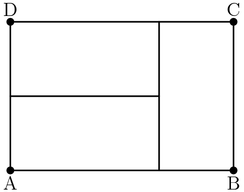
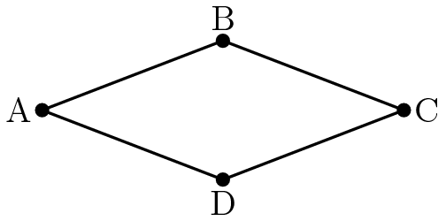
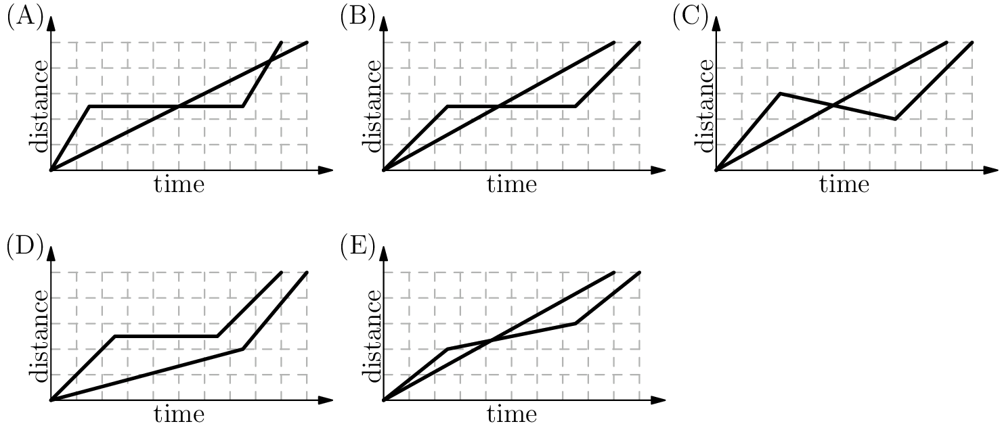
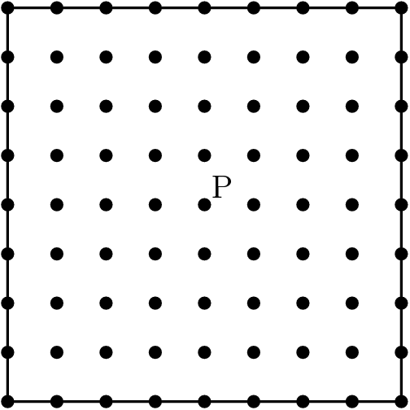
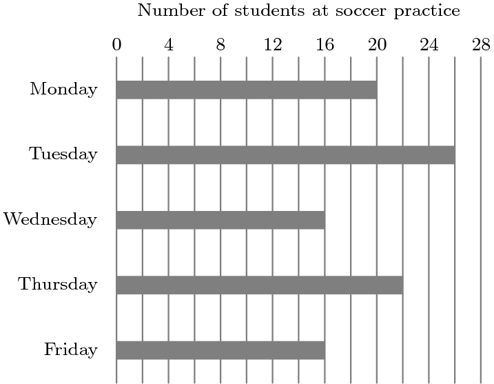
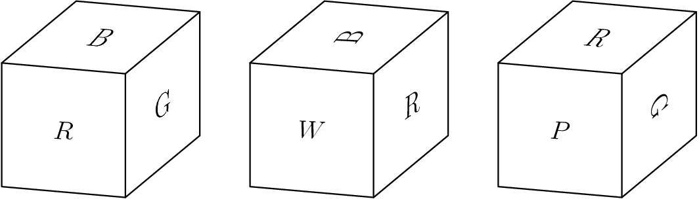

# 2019 AMC8

---

## Problem 1

Ike and Mike go into a sandwich shop with a total of $\$30.00$ to spend. Sandwiches cost $\$4.50$ each and soft drinks cost $\$1.00$ each. Ike and Mike plan to buy as many sandwiches as they can, and use any remaining money to buy soft drinks. Counting both sandwiches and soft drinks, how many items will they buy?

艾克和迈克走进一家三明治店，总共花了30美元。三明治每个4.5美元，软饮料每个1美元。艾克和迈克计划尽可能多地购买三明治，并用剩余的钱购买软饮料。算上三明治和软饮料，他们会买多少东西？

$\textbf{(A) }6\qquad\textbf{(B) }7\qquad\textbf{(C) }8\qquad\textbf{(D) }9\qquad\textbf{(E) }10$

## Problem 2

Three identical rectangles are put together to form rectangle $ABCD$, as shown in the figure below. Given that the length of the shorter side of each of the smaller rectangles is 5 feet, what is the area in square feet of rectangle $ABCD$?

三个相同的矩形放在一起形成矩形 $ABCD $，如下图所示。假设每个较小的矩形的较短边的长度是5英尺，那么矩形 $ABCD $的平方英尺面积是多少？

$\textbf{(A) }45\qquad\textbf{(B) }75\qquad\textbf{(C) }100\qquad\textbf{(D) }125\qquad\textbf{(E) }150$

## Problem 3

Which of the following is the correct order of the fractions $\dfrac{15}{11},\dfrac{19}{15},$ and $\dfrac{17}{13},$ from least to greatest?

下列哪个是分数 $\dfrac {15}{11} ，\dfrac {19}{15} ，$和 $\dfrac {17}{13} ，$从最小到最大的正确顺序？

$\textbf{(A) }\frac{15}{11}< \frac{17}{13}< \frac{19}{15}  \qquad\textbf{(B) }\frac{15}{11}< \frac{19}{15}<\frac{17}{13}    \qquad\textbf{(C) }\frac{17}{13}<\frac{19}{15}<\frac{15}{11}    \qquad\textbf{(D) } \frac{19}{15}<\frac{15}{11}<\frac{17}{13}   \qquad\textbf{(E) }   \frac{19}{15}<\frac{17}{13}<\frac{15}{11}$

## Problem 4

Quadrilateral $ABCD$ is a rhombus with perimeter $52$ meters. The length of diagonal $\overline{AC}$ is $24$ meters. What is the area in square meters of rhombus $ABCD$?

四边形 $ABCD $是一个周长为 $52 $米的菱形。对角线 $AC$的长度是 $24 $米。菱形的面积是多少平方米 $ABCD $？

$\textbf{(A) }60\qquad\textbf{(B) }90\qquad\textbf{(C) }105\qquad\textbf{(D) }120\qquad\textbf{(E) }144$

## Problem 5

A tortoise challenges a hare to a race. The hare eagerly agrees and quickly runs ahead, leaving the slow-moving tortoise behind. Confident that he will win, the hare stops to take a nap. Meanwhile, the tortoise walks at a slow steady pace for the entire race. The hare awakes and runs to the finish line, only to find the tortoise already there. Which of the following graphs matches the description of the race, showing the distance $d$ traveled by the two animals over time $t$ from start to finish?

乌龟向野兔挑战赛跑。兔子迫不及待地同意了，迅速地向前跑去，把行动缓慢的乌龟留在了后面。兔子相信自己会赢，停下来小睡一会儿。与此同时，乌龟在整个比赛中以缓慢而平稳的步伐行走。兔子醒了，跑到终点线，却发现乌龟已经在那里了。下面哪个图表符合对比赛的描述，显示了两个动物从开始到结束跑出的距离？

## Problem 6

There are $81$ grid points (uniformly spaced) in the square shown in the diagram below, including the points on the edges. Point $P$ is in the center of the square. Given that point $Q$ is randomly chosen among the other $80$ points, what is the probability that the line $PQ$ is a line of symmetry for the square?

在下图所示的正方形中有 $81 $网格点(均匀间隔) ，包括边缘上的点。点 $P $在广场的中心。假设点 $Q $是在其他 $ 80 $点中随机选择的，那么线 $PQ $是正方形的对称轴的概率是多少？

$\textbf{(A) }\frac{1}{5}\qquad\textbf{(B) }\frac{1}{4} \qquad\textbf{(C) }\frac{2}{5} \qquad\textbf{(D) }\frac{9}{20} \qquad\textbf{(E) }\frac{1}{2}$

## Problem 7

Shauna takes five tests, each worth a maximum of $100$ points. Her scores on the first three tests are $76$, $94$, and $87$. In order to average $81$ for all five tests, what is the lowest score she could earn on one of the other two tests?

肖娜参加了五次考试，每次最多得100分。她前三次考试的成绩分别是76，94和87。为了在所有五项测试中平均获得81，她在另外两项测试中所能获得的最低分是多少？

$\textbf{(A) }48\qquad\textbf{(B) }52\qquad\textbf{(C) }66\qquad\textbf{(D) }70\qquad\textbf{(E) }74$

## Problem 8

Gilda has a bag of marbles. She gives $20\%$ of them to her friend Pedro. Then Gilda gives $10\%$ of what is left to another friend, Ebony. Finally, Gilda gives $25\%$ of what is now left in the bag to her brother Jimmy. What percentage of her original bag of marbles does Gilda have left for herself?

Gilda 有一袋弹珠。她把其中的20% 给了她的朋友Pedro。然后 Gilda 把剩下的10% 给了另一个朋友 Ebony。最后，吉尔达把袋子里剩下的25% 给了她哥哥Jimmy。Gilda 留给自己的弹珠有多少百分比？

$\textbf{(A) }20\qquad\textbf{(B) }33\frac{1}{3}\qquad\textbf{(C) }38\qquad\textbf{(D) }45\qquad\textbf{(E) }54$

## Problem 9

Alex and Felicia each have cats as pets. Alex buys cat food in cylindrical cans that are $6$ cm in diameter and $12$ cm high. Felicia buys cat food in cylindrical cans that are $12$ cm in diameter and $6$ cm high. What is the ratio of the volume of one of Alex's cans to the volume one of Felicia's cans?

Alex 和 Felicia 都养猫当宠物。亚历克斯买的猫粮装在圆柱形的罐子里，直径6，高12。Felicia 买的猫粮装在圆柱形的罐子里，直径12，高6。Alex 的罐头和 Felicia 的罐头的体积比是多少？

$\textbf{(A) }1:4\qquad\textbf{(B) }1:2\qquad\textbf{(C) }1:1\qquad\textbf{(D) }2:1\qquad\textbf{(E) }4:1$

## Problem 10

The diagram shows the number of students at soccer practice each weekday during last week. After computing the mean and median values, Coach discovers that there were actually $21$ participants on Wednesday. Which of the following statements describes the change in the mean and median after the correction is made?

图表显示了上周每个工作日参加足球训练的学生人数。在计算了平均值和中位数后，Coach 发现周三实际上有21名参与者。下列哪项陈述描述了修正后平均值和中位数的变化？

$\textbf{(A) }$ The mean increases by $1$ and the median does not change.

$\textbf{(B) }$ The mean increases by $1$ and the median increases by $1$.

$\textbf{(C) }$ The mean increases by $1$ and the median increases by $5$.

$\textbf{(D) }$ The mean increases by $5$ and the median increases by $1$.

$\textbf{(E) }$ The mean increases by $5$ and the median increases by $5$.

$\textbf{(A) }$ 平均值增加 $1$，中位数没有变化。

$\textbf{(B) }$ 平均值增加 $1 $，中位数增加 $1 $。

$\textbf{(C) }$ 平均值增加 $1 $，中位数增加 $5 $。

$\textbf{(D)} $  平均值增加 $5$，中位数增加$1$。

$\textbf{(E) }$ 平均值增加 $5 $，中位数增加 $5 $。

## Problem 11

The eighth grade class at Lincoln Middle School has $93$ students. Each student takes a math class or a foreign language class or both. There are $70$ eighth graders taking a math class, and there are $54$ eight graders taking a foreign language class. How many eight graders take *only* a math class and *not* a foreign language class?

林肯中学八年级的学生有93。每个学生选修一门数学课或一门外语课，或两者兼修。有70的八年级学生上数学课，有54的八年级学生上外语课。有多少八年级的学生只上数学课而不上外语课？

$\textbf{(A) }16\qquad\textbf{(B) }23\qquad\textbf{(C) }31\qquad\textbf{(D) }39\qquad\textbf{(E) }70$

## Problem 12

The faces of a cube are painted in six different colors: red $(R)$, white $(W)$, green $(G)$, brown $(B)$, aqua $(A)$, and purple $(P)$. Three views of the cube are shown below. What is the color of the face opposite the aqua face?

立方体的面被涂成六种不同的颜色: 红色 $(R) $，白色 $(W) $，绿色 $(G) $，棕色 $(B) $，水绿色 $(A) $和紫色 $(P) $。下面显示了立方体的三个视图。$A$的对面是什么颜色？

$\textbf{(A) }\text{red}\qquad\textbf{(B) }\text{white}\qquad\textbf{(C) }\text{green}\qquad\textbf{(D) }\text{brown}\qquad\textbf{(E) }\text{purple}$

## Problem 13

A *palindrome* is a number that has the same value when read from left to right or from right to left. (For example, 12321 is a palindrome.) Let $N$ be the least three-digit integer which is not a palindrome but which is the sum of three distinct two-digit palindromes. What is the sum of the digits of $N$?

一个回文数是一个从左到右或从右到左读取时具有相同值的数字。(例如，12321是一个回文。)设 $N $是最小的三位数整数，它不是回文，而是三个不同的两位数回文的和。$N $的位数之和是多少？

$\textbf{(A) }2\qquad\textbf{(B) }3\qquad\textbf{(C) }4\qquad\textbf{(D) }5\qquad\textbf{(E) }6$

## Problem 14

Isabella has $6$ coupons that can be redeemed for free ice cream cones at Pete's Sweet Treats. In order to make the coupons last, she decides that she will redeem one every $10$ days until she has used them all. She knows that Pete's is closed on Sundays, but as she circles the $6$ dates on her calendar, she realizes that no circled date falls on a Sunday. On what day of the week does Isabella redeem her first coupon?

Isabella 有6的优惠券，可以在 Pete’s Sweet Treats 兑换免费的冰淇淋甜筒。为了使优惠券用的久一些，她决定每10天兑换一张，直到用完为止。她知道 Pete’s 周日不营业，但是当她在日历上圈出6个日期时，她意识到没有一个圈出来的日期是在周日。Isabella 会在星期几兑换她的第一张优惠券？

$\textbf{(A) }\text{Monday}\qquad\textbf{(B) }\text{Tuesday}\qquad\textbf{(C) }\text{Wednesday}\qquad\textbf{(D) }\text{Thursday}\qquad\textbf{(E) }\text{Friday}$

## Problem 15

On a beach $50$ people are wearing sunglasses and $35$ people are wearing caps. Some people are wearing both sunglasses and caps. If one of the people wearing a cap is selected at random, the probability that this person is also wearing sunglasses is $\frac{2}{5}$. If instead, someone wearing sunglasses is selected at random, what is the probability that this person is also wearing a cap?

在海滩上，50人戴着太阳镜，35人戴着帽子。有些人既戴太阳镜又戴帽子。如果随机选择一个戴帽子的人，那么这个人也戴太阳镜的概率是 $\dfrac {2}{5} $。如果随机选择一个戴太阳镜的人，这个人戴帽子的可能性有多大？

$\textbf{(A) }\frac{14}{85}\qquad\textbf{(B) }\frac{7}{25}\qquad\textbf{(C) }\frac{2}{5}\qquad\textbf{(D) }\frac{4}{7}\qquad\textbf{(E) }\frac{7}{10}$

## Problem 16

Qiang drives $15$ miles at an average speed of $30$ miles per hour. How many additional miles will he have to drive at $55$ miles per hour to average $50$ miles per hour for the entire trip?

Qiang每小时的平均车速为30英里，行驶里程为15英里。在整个旅程中，他必须以每小时55的速度再行驶多少英里，才能达到平均每小时50的速度？

$\textbf{(A) }45\qquad\textbf{(B) }62\qquad\textbf{(C) }90\qquad\textbf{(D) }110\qquad\textbf{(E) }135$

## Problem 17

What is the value of the product$\left(\frac{1\cdot3}{2\cdot2}\right)\left(\frac{2\cdot4}{3\cdot3}\right)\left(\frac{3\cdot5}{4\cdot4}\right)\cdots\left(\frac{97\cdot99}{98\cdot98}\right)\left(\frac{98\cdot100}{99\cdot99}\right)?$

这个式子的乘积是多少？

$\textbf{(A) }\frac{1}{2}\qquad\textbf{(B) }\frac{50}{99}\qquad\textbf{(C) }\frac{9800}{9801}\qquad\textbf{(D) }\frac{100}{99}\qquad\textbf{(E) }50$

## Problem 18

The faces of each of two fair dice are numbered $1$, $2$, $3$, $5$, $7$, and $8$. When the two dice are tossed, what is the probability that their sum will be an even number?

两个公平骰子的面分别编号为 $1 $、 $2 $、 $3 $、 $5 $、 $7 $和 $8 $。当掷两个骰子时，它们的和是偶数的概率是多少？

$\textbf{(A) }\frac{4}{9}\qquad\textbf{(B) }\frac{1}{2}\qquad\textbf{(C) }\frac{5}{9}\qquad\textbf{(D) }\frac{3}{5}\qquad\textbf{(E) }\frac{2}{3}$

## Problem 19

In a tournament there are six teams that play each other twice. A team earns $3$ points for a win, $1$ point for a draw, and $0$ points for a loss. After all the games have been played it turns out that the top three teams earned the same number of total points. What is the greatest possible number of total points for each of the top three teams?

在一个锦标赛中，有六支球队相互比赛两次。一支球队赢球得3分，平局得1分，输球得0分。在所有的比赛结束后，结果表明，前三名的球队获得了相同的总分。前三名球队的总得分最多是多少？

$\textbf{(A) }22\qquad\textbf{(B) }23\qquad\textbf{(C) }24\qquad\textbf{(D) }26\qquad\textbf{(E) }30$

## Problem 20

How many different real numbers $x$ satisfy the equation$(x^{2}-5)^{2}=16?$

有多少个不同的实数 $x $满足这个等式？

$\textbf{(A) }0\qquad\textbf{(B) }1\qquad\textbf{(C) }2\qquad\textbf{(D) }4\qquad\textbf{(E) }8$

## Problem 21

What is the area of the triangle formed by the lines $y=5$, $y=1+x$, and $y=1-x$?

由直线 $y=5$, $y=1+x$, 和 $y=1-x$构成的三角形的面积是多少

$\textbf{(A) }4\qquad\textbf{(B) }8\qquad\textbf{(C) }10\qquad\textbf{(D) }12\qquad\textbf{(E) }16$

## Problem 22

A store increased the original price of a shirt by a certain percent and then decreased the new price by the same amount. Given that the resulting price was $84\%$ of the original price, by what percent was the price increased and decreased?

一家商店把一件衬衫的原价提高了一个百分点，然后又把新价格降低了相同的百分点。考虑到最终的价格是原始价格的84% ，那么价格上涨和下跌的百分比是多少呢？

$\textbf{(A) }16\qquad\textbf{(B) }20\qquad\textbf{(C) }28\qquad\textbf{(D) }36\qquad\textbf{(E) }40$

## Problem 23

After Euclid High School's last basketball game, it was determined that $\frac{1}{4}$ of the team's points were scored by Alexa and $\frac{2}{7}$ were scored by Brittany. Chelsea scored $15$ points. None of the other $7$ team members scored more than $2$ points. What was the total number of points scored by the other $7$ team members?

在欧几里德高中的最后一场篮球比赛后，确定球队得分中的$\frac{1}{4}$由Alexa得分，$\frac{2}{7}$由Brittany得分。Chelsea得到了15分数。其他$7$个团队成员的得分都没有超过$2$分。其他$7$个团队成员的总分是多少？

$\textbf{(A) }10\qquad\textbf{(B) }11\qquad\textbf{(C) }12\qquad\textbf{(D) }13\qquad\textbf{(E) }14$

## Problem 24

In triangle $ABC$, point $D$ divides side $\overline{AC}$ so that $AD:DC=1:2$. Let $E$ be the midpoint of $\overline{BD}$ and let $F$ be the point of intersection of line $BC$ and line $AE$. Given that the area of $\triangle ABC$ is $360$, what is the area of $\triangle EBF$?

在三角形 $ABC $中，点 $D $分割边 $\overline { AC } $使 $AD: DC = 1:2 $。设 $E $为 $\overline { BD } $的中点，设 $F $为 $BC $和 $AE $的交点。假设 $\triangle ABC $的面积是 $360 $，那么 $\triangle EBF $的面积是多少？

$\textbf{(A) }24\qquad\textbf{(B) }30\qquad\textbf{(C) }32\qquad\textbf{(D) }36\qquad\textbf{(E) }40$

## Problem 25

Alice has 24 apples. In how many ways can she share them with Becky and Chris so that each of the three people has at least two apples? 

Chris有24个苹果。她可以用多少种方式与Becky和Chris分享这些苹果，这样三个人中的每个人都至少有两个苹果？

$\textbf{(A) }105\qquad\textbf{(B) }114\qquad\textbf{(C) }190\qquad\textbf{(D) }210\qquad\textbf{(E) }380$

