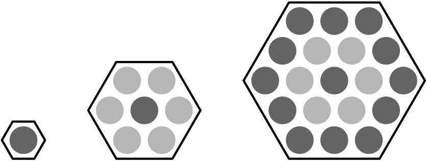
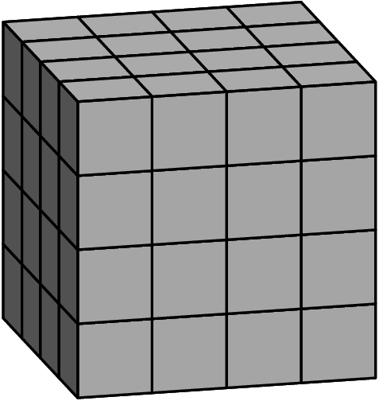
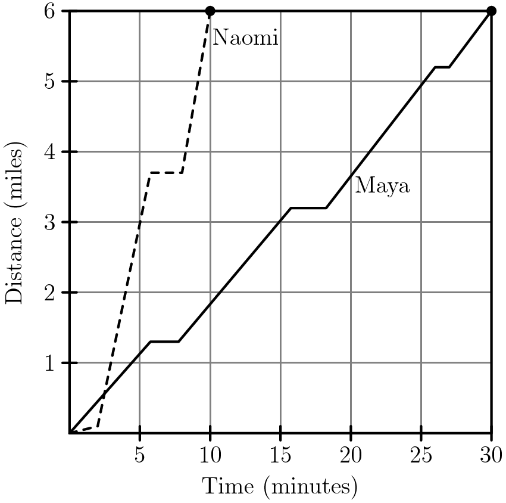
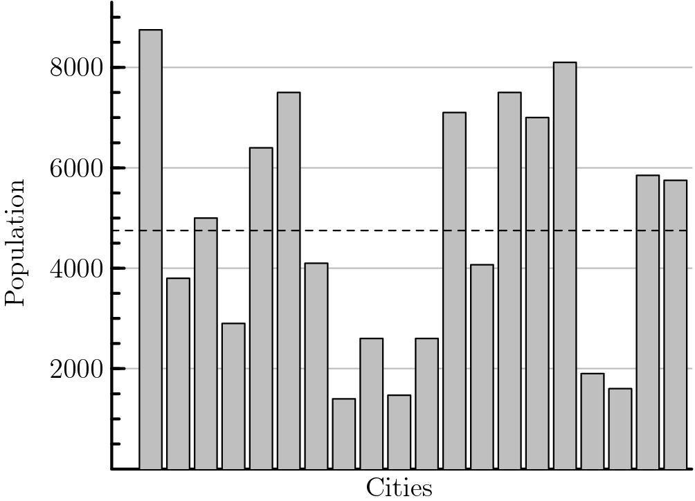
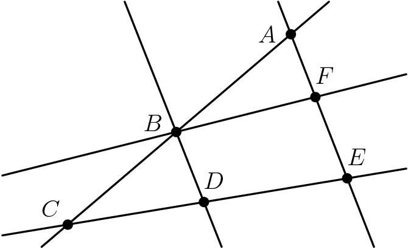
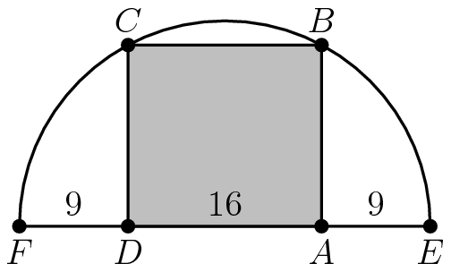
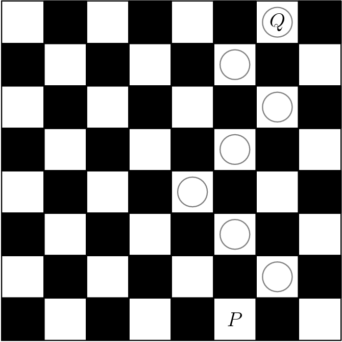
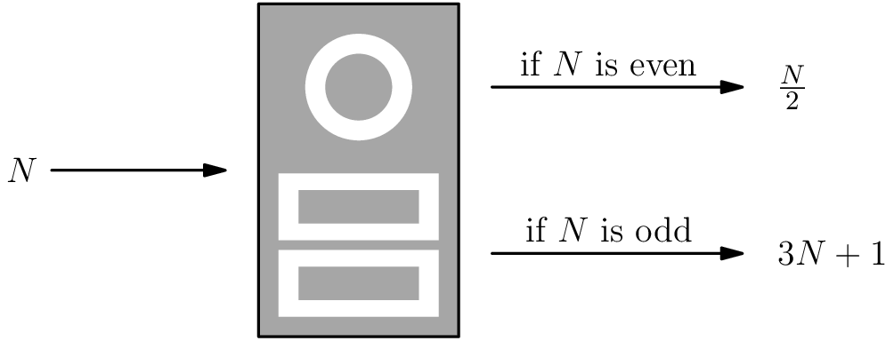
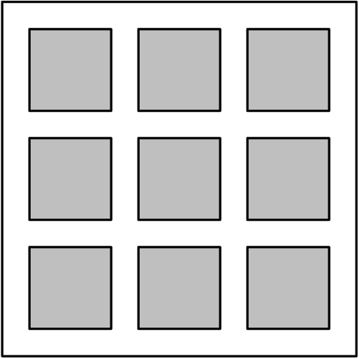
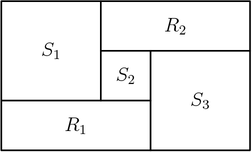

# 2020 AMC8

---

## Problem 1

Luka is making lemonade to sell at a school fundraiser. His recipe requires $4$ times as much water as sugar and twice as much sugar as lemon juice. He uses $3$ cups of lemon juice. How many cups of water does he need?

Luka 在做柠檬水，准备在学校筹款会上卖。他的食谱需要的水是糖的4倍，糖是柠檬汁的两倍。他用了三杯柠檬汁。他需要多少杯水？

$\textbf{(A) } 6\qquad\textbf{(B) } 8\qquad\textbf{(C) } 12\qquad\textbf{(D) } 18\qquad\textbf{(E) } 24\qquad$

## Problem 2

Four friends do yardwork for their neighbors over the weekend, earning $15, $20, $25,$ and $40,$ respectively. They decide to split their earnings equally among themselves. In total how much will the friend who earned $40$ give to the others?

四个朋友在周末为他们的邻居打理庭院，分别挣15美元、20美元、25美元和40美元。他们决定平均分配收入。赚了40美元的朋友总共会给其他人多少钱？

$\textbf{(A) }5 \qquad \textbf{(B) }10 \qquad \textbf{(C) }15 \qquad \textbf{(D) }20 \qquad \textbf{(E) }25$

## Problem 3

Carrie has a rectangular garden that measures $6$ feet by $8$ feet. She plants the entire garden with strawberry plants. Carrie is able to plant $4$ strawberry plants per square foot, and she harvests an average of $10$ strawberries per plant. How many strawberries can she expect to harvest? 

嘉莉有一个长方形的花园，大小为6英尺乘8英尺。她把整个花园种满了草莓。嘉莉能够种植每平方英尺4棵草莓，她平均每株收获10棵草莓。她能收获多少草莓？

$\textbf{(A) }560 \qquad \textbf{(B) }960 \qquad \textbf{(C) }1120 \qquad \textbf{(D) }1920 \qquad \textbf{(E) }3840$

## Problem 4

Three hexagons of increasing size are shown below. Suppose the dot pattern continues so that each successive hexagon contains one more band of dots. How many dots are in the next hexagon?

下面显示了三个尺寸不断增大的六边形。假设按照这种规律继续画，以便下一个六边形比上一个包含多一圈点。下一个六边形有多少个点？

$\textbf{(A) }35 \qquad \textbf{(B) }37 \qquad \textbf{(C) }39 \qquad \textbf{(D) }43 \qquad \textbf{(E) }49$

## Problem 5

Three fourths of a pitcher is filled with pineapple juice. The pitcher is emptied by pouring an equal amount of juice into each of $5$ cups. What percent of the total capacity of the pitcher did each cup receive?

四分之三的水罐装满了菠萝汁。在5个杯子里倒入等量的果汁，就可以把罐子里的果汁倒空。每个杯子占水罐的总容量的百分比是多少？

$\textbf{(A) }5 \qquad \textbf{(B) }10 \qquad \textbf{(C) }15 \qquad \textbf{(D) }20 \qquad \textbf{(E) }25$

## Problem 6

Aaron, Darren, Karen, Maren, and Sharon rode on a small train that has five cars that seat one person each. Maren sat in the last car. Aaron sat directly behind Sharon. Darren sat in one of the cars in front of Aaron. At least one person sat between Karen and Darren. Who sat in the middle car?

亚伦、达伦、凯伦、马伦和莎伦乘坐的是一列小火车，有五节车厢，每节车厢只能坐一个人。Maren坐在最后一辆车里。Aaron坐在Sharon的正后方。Darren 坐在 Aaron 前面的一辆车里。至少有一个人坐在 Karen 和 Darren 中间。谁坐在中间的车厢？

$\textbf{(A) }\text{Aaron} \qquad \textbf{(B) }\text{Darren} \qquad \textbf{(C) }\text{Karen} \qquad \textbf{(D) }\text{Maren}\qquad \textbf{(E) }\text{Sharon}$

## Problem 7

How many integers between $2020$ and $2400$ have four distinct digits arranged in increasing order? (For example, $2347$ is one integer.)

在 $2020 $和 $2400 $之间有多少个整数是按递增顺序排列的？(例如，$2347 $)

$\textbf{(A) }\text{9} \qquad \textbf{(B) }\text{10} \qquad \textbf{(C) }\text{15} \qquad \textbf{(D) }\text{21}\qquad \textbf{(E) }\text{28}$

## Problem 8

Ricardo has $2020$ coins, some of which are pennies ($1$-cent coins) and the rest of which are nickels ($5$-cent coins). He has at least one penny and at least one nickel. What is the difference in cents between the greatest possible and least possible amounts of money that Ricardo can have?

Ricardo有2020个硬币，其中一些是硬币(1美分硬币) ，其余的是五分硬币(5美分硬币)。他至少有一枚一分和一枚五分硬币。Ricardo所能拥有的最大数额和最小数额的钱按美分计算相差多少？

$\textbf{(A) }\text{8062} \qquad \textbf{(B) }\text{8068} \qquad \textbf{(C) }\text{8072} \qquad \textbf{(D) }\text{8076}\qquad \textbf{(E) }\text{8082}$

## Problem 9

Akash's birthday cake is in the form of a $4 \times 4 \times 4$ inch cube. The cake has icing on the top and the four side faces, and no icing on the bottom. Suppose the cake is cut into $64$ smaller cubes, each measuring $1 \times 1 \times 1$ inch, as shown below. How many small pieces will have icing on exactly two sides?

Akash的生日蛋糕是一个4乘以4乘以4英寸的立方体。蛋糕的顶部和四个面都有糖霜，底部没有糖霜。假设蛋糕被切成64的小方块，每个1乘以1乘以1英寸，如下所示。有多少小块的糖霜会在正好两边？

$\textbf{(A) }\text{12} \qquad \textbf{(B) }\text{16} \qquad \textbf{(C) }\text{18} \qquad \textbf{(D) }\text{20}\qquad \textbf{(E) }\text{24}$

## Problem 10

Zara has a collection of $4$ marbles: an Aggie, a Bumblebee, a Steelier, and a Tiger. She wants to display them in a row on a shelf, but does not want to put the Steelier and the Tiger next to one another. In how many ways can she do this?

Zara 收集了4块大理石: 一个 Aggie，一个 Bumblebee，一个 Steelier 和一个 Tiger。她想把它们在架子上摆一排，但又不想把“Steelier”和“Tiger”放在一起。她有多少种方法可以做到这一点？

$\textbf{(A) }6 \qquad \textbf{(B) }8 \qquad \textbf{(C) }12 \qquad \textbf{(D) }18 \qquad \textbf{(E) }24$

## Problem 11

After school, Maya and Naomi headed to the beach, $6$ miles away. Maya decided to bike while Naomi took a bus. The graph below shows their journeys, indicating the time and distance traveled. What was the difference, in miles per hour, between Naomi's and Maya's average speeds?

放学后，玛雅和娜奥米前往海滩，6英里远。娜奥米坐公交车时，玛雅决定骑自行车。下面的图表显示了它们的旅程，表明了它们旅行的时间和距离。娜奥米和玛雅的平均时速相差多少？

$\textbf{(A) }6 \qquad \textbf{(B) }12 \qquad \textbf{(C) }18 \qquad \textbf{(D) }20 \qquad \textbf{(E) }24$

## Problem 12

For a positive integer $n,$ the factorial notation $n!$ represents the product of the integers from $n$ to $1$. (For example, $6! = 6 \cdot 5 \cdot 4 \cdot 3 \cdot 2 \cdot 1$.) What value of $N$ satisfies the following equation?  $5! \cdot 9! = 12 \cdot N!$

对于正整数 $n，$阶乘符号 $n!$表示从 $n $到 $1 $的整数乘积。(例如，$6!= 6 \cdot 5 \cdot 4 \cdot 3 \cdot 2 \cdot 1 $)$N $为什么值的时候满足以下等式？$5!\cdot 9!= 12 \cdot N!$

$\textbf{(A) }10 \qquad \textbf{(B) }11 \qquad \textbf{(C) }12 \qquad \textbf{(D) }13 \qquad \textbf{(E) }14$

## Problem 13

Jamal has a drawer containing $6$ green socks, $18$ purple socks, and $12$ orange socks. After adding more purple socks, Jamal noticed that there is now a $60\%$ chance that a sock randomly selected from the drawer is purple. How many purple socks did Jamal add?

Jamal有一个抽屉，里面装着6只绿色袜子，18只紫色袜子和12只橙色袜子。在添加了更多的紫色袜子后，贾马尔注意到现在有60% 的机会从抽屉中随机选择的袜子是紫色的。贾马尔加了多少只紫袜子？

$\textbf{(A) }6 \qquad \textbf{(B) }9 \qquad \textbf{(C) }12 \qquad \textbf{(D) }18 \qquad \textbf{(E) }24$

## Problem 14

There are $20$ cities in the County of Newton. Their populations are shown in the bar chart below. The average population of all the cities is indicated by the horizontal dashed line. Which of the following is closest to the total population of all $20$ cities?

在牛顿郡有20个城市。它们的种群数量如下图所示。所有城市的平均人口用水平虚线表示。下列哪一项最接近所有20个城市的总人口？

$\textbf{(A) }65{,}000 \qquad \textbf{(B) }75{,}000 \qquad \textbf{(C) }85{,}000 \qquad \textbf{(D) }95{,}000 \qquad \textbf{(E) }105{,}000$

## Problem 15

Suppose $15\%$ of $x$ equals $20\%$ of $y.$ What percentage of $x$ is $y?$

假设 $x $的15% $等于 $y 的20%，$x $的多少百分比是$y$？

$\textbf{(A) }5 \qquad \textbf{(B) }35 \qquad \textbf{(C) }75 \qquad \textbf{(D) }133 \frac13 \qquad \textbf{(E) }300$

## Problem 16

Each of the points $A,B,C,D,E,$ and $F$ in the figure below represents a different digit from $1$ to $6.$ Each of the five lines shown passes through some of these points. The digits along each line are added to produce five sums, one for each line. The total of the five sums is $47.$ What is the digit represented by B?

下图中的每个点 $A、 B、 C、 D、 E、 $和 $F $代表一个从 $1到 $6的不同数字。所示的五条线中的每一条都通过这些点。沿着每一行的数字被加起来得到五个和，每一条线一个。五个和总共$47$。$B$ 代表的数字是什么？

$\textbf{(A) }1 \qquad \textbf{(B) }2 \qquad \textbf{(C) }3 \qquad \textbf{(D) }4 \qquad \textbf{(E) }5$

## Problem 17

How many factors of $2020$ have more than $3$ factors? (As an example, $12$ has $6$ factors, namely $1, 2, 3, 4, 6,$ and $12.$)

有多少 $2020 $的因数有超过 $3 $个因数？(如，$12 $有 $6 $个因数，即 $1,2,3,4,6$和 $12$)

$\textbf{(A) }6 \qquad \textbf{(B) }7 \qquad \textbf{(C) }8 \qquad \textbf{(D) }9 \qquad \textbf{(E) }10$

## Problem 18

Rectangle $ABCD$ is inscribed in a semicircle with diameter $\overline{FE},$ as shown in the figure. Let $DA=16,$ and let $FD=AE=9.$ What is the area of $ABCD?$

矩形 $ABCD $被刻在一个直径为 $\overline { FE }$的半圆中，如图所示。 $DA = 16$， $FD = AE = 9$。$ABCD$ 的面积是多少？

$\textbf{(A) }240 \qquad \textbf{(B) }248 \qquad \textbf{(C) }256 \qquad \textbf{(D) }264 \qquad \textbf{(E) }272$

## Problem 19

A number is called flippy if its digits alternate between two distinct digits. For example, $2020$ and $37373$ are flippy, but $3883$ and $123123$ are not. How many five-digit flippy numbers are divisible by $15?$

如果一个数字的数字在两个不同的数字之间交替，那么这个数字就叫交替数。例如，$2020 $和 $37373 $是交替数，但 $3883 $和 $123123 $不是。请问有多少个五位的交替数可以被$15$整除？

$\textbf{(A) }3 \qquad \textbf{(B) }4 \qquad \textbf{(C) }5 \qquad \textbf{(D) }6 \qquad \textbf{(E) }8$

## Problem 20

A scientist walking through a forest recorded as integers the heights of $5$ trees standing in a row. She observed that each tree was either twice as tall or half as tall as the one to its right. Unfortunately some of her data was lost when rain fell on her notebook. Her notes are shown below, with blanks indicating the missing numbers. Based on her observations, the scientist was able to reconstruct the lost data. What was the average height of the trees, in meters?

一位科学家走过一片一排5棵树，高度记录为整数的森林。她观察到，每棵树要么是右边那棵树的两倍高，要么是它的一半高。不幸的是，当雨点落在她的笔记本上时，她的一些数据丢失了。她的笔记如下所示，空格表示缺失的数字。根据她的观察，这位科学家能够重建丢失的数据。这些树的平均高度是多少，以米为单位？

$\begin{array}{|c|c|}
\hline \text { Tree } 1 & \text { - meters } \\
\text { Tree } 2 & 11 \text { meters } \\
\text { Tree } 3 & \text { - meters } \\
\text { Tree } 4 & \text { - meters } \\
\text { Tree } 5 &  \text { - meters } \\
\hline \text { Average height } & \text { - } .2 \text { meters } \\
\hline
\end{array}$

$\textbf{(A) }22.2 \qquad \textbf{(B) }24.2 \qquad \textbf{(C) }33.2 \qquad \textbf{(D) }35.2 \qquad \textbf{(E) }37.2$

## Problem 21

A game board consists of $64$ squares that alternate in color between black and white. The figure below shows square $P$ in the bottom row and square $Q$ in the top row. A marker is placed at $P.$ A step consists of moving the marker onto one of the adjoining white squares in the row above. How many $7$-step paths are there from $P$ to $Q?$ (The figure shows a sample path.)

一个游戏棋盘由64个正方形组成，它们在黑色和白色之间交替变换颜色。下图显示了底部行的正方形 P 和顶部行的正方形 Q。在 P 处放置一个标记。“一步”可以将标记移动到上面一行中相邻的一个白色方块上。从 P 到 Q 有多少个7步路径？(图中显示了一个示例路径。)

$\textbf{(A) }28 \qquad \textbf{(B) }30 \qquad \textbf{(C) }32 \qquad \textbf{(D) }33 \qquad \textbf{(E) }35$

## Problem 22

When a positive integer $N$ is fed into a machine, the output is a number calculated according to the rule shown below.

当一个正整数 $N $被输入一台机器时，输出是一个根据下面所示规则计算的数字。

For example, starting with an input of $N=7,$ the machine will output $3 \cdot 7 +1 = 22.$ Then if the output is repeatedly inserted into the machine five more times, the final output is $26$.  $7 \to 22 \to 11 \to 34 \to 17 \to 52 \to 26$ When the same $6$-step process is applied to a different starting value of $N,$ the final output is $1.$ What is the sum of all such integers $N?$

例如，从 $N = 7$的输入开始，这台机器将会输出$3 \cdot 7 + 1 = 22$。然后，如果将输出再重复输入机器$5$次，最终输出为$26$。$7→22→11→34→17→52→26$。当以$N$为起点，同样的输入$6$次，最终的输出结果为$1$时，所有可能的整数 N 的和是多少? 

$N \to \rule{0.5cm}{0.15mm} \to \rule{0.5cm}{0.15mm} \to \rule{0.5cm}{0.15mm} \to \rule{0.5cm}{0.15mm} \to \rule{0.5cm}{0.15mm} \to 1$

$\textbf{(A) }73 \qquad \textbf{(B) }74 \qquad \textbf{(C) }75 \qquad \textbf{(D) }82 \qquad \textbf{(E) }83$

## Problem 23

Five different awards are to be given to three students. Each student will receive at least one award. In how many different ways can the awards be distributed?

将给三名学生颁发五个不同的奖项。每个学生将至少获得一个奖项。奖项可以通过多少种不同的方式分配？

$\textbf{(A) }120 \qquad \textbf{(B) }150 \qquad \textbf{(C) }180 \qquad \textbf{(D) }210 \qquad \textbf{(E) }240$

## Problem 24

A large square region is paved with $n^2$ gray square tiles, each measuring $s$ inches on a side. A border $d$ inches wide surrounds each tile. The figure below shows the case for $n=3$. When $n=24$ , the $576$ gray tiles cover $64\%$ of the area of the large square region. What is the ratio $\dfrac{d}{s}$ for this larger value of $n?$

一个大的正方形区域铺设了 $n^2$灰色的正方形瓷砖，每个瓷砖边长为 $s$ 英寸。每块瓷砖周围都有一个宽 $d$ 英寸的边框。下图显示了$ n = 3$的情况。当 $n = 24$时，$576$个灰色瓦片覆盖了大方形区域面积的 $64%$ 。此时 $\dfrac{d}{s}$ 是多少？

$\textbf{(A) }\frac6{25} \qquad \textbf{(B) }\frac14 \qquad \textbf{(C) }\frac9{25} \qquad \textbf{(D) }\frac7{16} \qquad \textbf{(E) }\frac9{16}$

## Problem 25

Rectangles $R_1$ and $R_2,$ and squares $S_1,\,S_2,\,$ and $S_3,$ shown below, combine to form a rectangle that is $3322$ units wide and $2020$ units high. What is the side length of $S_2$ in units?

矩形 $R_1$和 $R_2$，以及正方形 $S_1，S_2$和 $S_3$，如下所示，结合起来形成一个长方形，宽$3322$个单位，高$2020$个单位。$S_2$的边长是多少？

$\textbf{(A) }651 \qquad \textbf{(B) }655 \qquad \textbf{(C) }656 \qquad \textbf{(D) }662 \qquad \textbf{(E) }666$