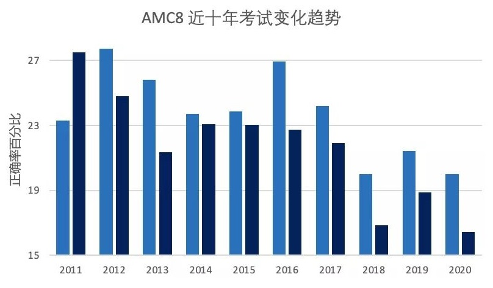
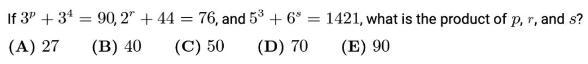
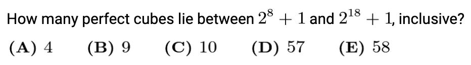
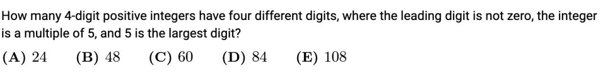
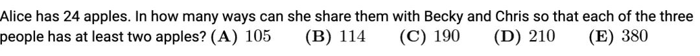
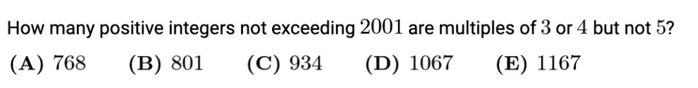
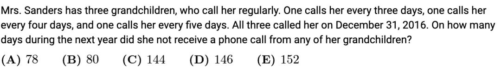
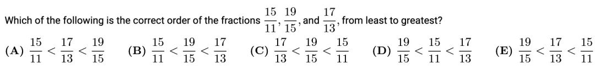
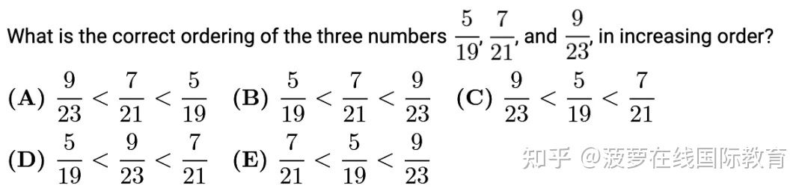

# AMC8 趋势

2021和2022年的AMC8趋势显现，和 AMC 10和 12 一样，都大幅增加了计算量，我们的孩子准备好了吗？整理了 MAA 官方公布的 AMC 8 近十年最后十题正确率的数据。不难看出，题越来越难了，最后五题更是难上加难。那么到底是怎么变难了呢？

我们来看一下最后10题和最后5题的正确率：



**难度变化大致有以下 5 点：**

```tip 1
1、相同知识点，计算量变大
```

这里用一个代数计算的例子对比下 10 年间，对学生计算能力要求的变化。

针对指数的计算，之前的 AMC 8 的对指数计算的考察主要是5次方以内，例如这一道2013年的题。



而到了 2018年 AMC 8 中指数计算知识点考察，要求学生要熟练掌握关于 2 的 2 次方到 10次方以及 1-10 的立方。如果你的孩子也是从小使用计算器做数学题到初中的，遇到类似这样复杂的计算，孩子是否能离开计算器独立完成呢？



这道题其实每一步分解开，都只是一道中等难度的题目，但是合在一起就变成很多同学眼中的难题，遇到这样相对复杂的计算，孩子真的很容易放弃，做题的耐心和毅力，不是一蹴而就的，都是需要日积月累的，小学高年级和初中阶段，多参加一些数学竞赛的好处之一，可以磨炼孩子的毅力，将来人生中遇到的困难也能够勇敢面对，不至于不战而逃。

### 2、同一知识点，考察深度增加

以计数为例，早期出现在 AMC8 中计数题仅仅要求学生掌握基本的组合数运算。如果涉及到分类讨论，是可以作为压轴题出现了。例如这道 2011 年 AMC8 中的第23题，其主要“难点”就是分类讨论。相信对于现在参加 AMC 8 的同学来说，这样的分类讨论题怎么做，基本上不存在太大难度了。



而到了 2020 年 AMC 8 的第 25 题压轴题也是一道计数题。解题的技巧已经上升到了在更高年级竞赛中标配的“隔板法”。即便是在初中和小学阶段课内很少接触的计数题，也渐渐拓展了深度和难度。



**3、以前 AMC10** **考题，开始出现在** **AMC 8 了**

相信现在很多的中学生回到 17 世纪，都很有可能在微积分的造诣上打败牛顿。同样，随着时间推移，以往只有高年级“大神”才能做出来的题，也更频繁地出现在 AMC 8 的考试中。AMC 8 中由十年，二十年，甚至三十年前 AMC10 或者 AHSME 改编的题目真的是不胜枚举。

你看出下面两道题的类似之处了吗？

2001 年 AMC10 第25题



2017 年 AMC8 第23题



**4、相似的题，题号变小**

这一点也是难度提升的另一佐证。来看下下面两道题大家猜猜应该算是 1-25 哪一个区间的题目呢？

例题 1



例题 2



答案：例 1 是 2019 年 AMC 8 中的第 3 题，而例 2 则是 2012 年 AMC 8 中的第 20 题。是不是有一种假如回到过去自动成为学霸的错觉。

**5、题目真的真的真的变长了**

你知道 2011 年的 AMC 8 考卷有多少个英文单词么？粗略地统计了一下大概是 700~800 个单词。那么 2020 年的 AMC 8 考卷有多少个英文单词呢？1500 个！阅读量增加一倍，而且题目里还裹着里三层外三层的背景知识，学生可能读懂了每个单词，但合在一起看还是一知半解，还是不会设 X，不会列方程。

所以计算量更大了，知识点要求更深了，题目还变长了。